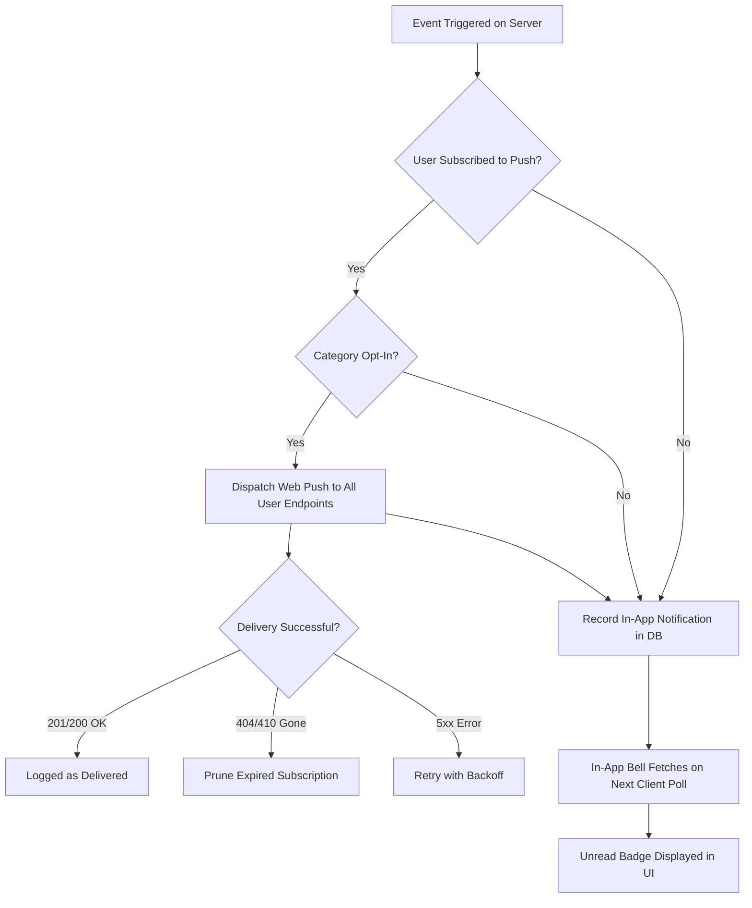

# AbhiHub Notification Cross-Platform Support Matrix

**Date:** 2026-09-11  
**Project:** AbhiHub Notification Reliability  
**Specification:** Web Push (RFC 8030 / VAPID) & In-App Notification Center  

---

## 1. Operating System & Browser Compatibility Matrix

| OS / Platform | Browser | Web Push Support | In-App Bell Support | Background / Closed Tab Delivery | Action Buttons & Icons | Known Platform Limitations & Requirements |
| :--- | :--- | :---: | :---: | :---: | :---: | :--- |
| **Windows 10 / 11** | Google Chrome (110+) | ✅ Supported | ✅ Supported | ✅ Full (Background process) | ✅ Full | Standard Windows Focus Assist / Quiet Hours may mute native banners. |
| **Windows 10 / 11** | Microsoft Edge (110+) | ✅ Supported | ✅ Supported | ✅ Full (Startup boost) | ✅ Full | Native Windows notification center integration. |
| **Windows / Linux** | Mozilla Firefox (115+) | ✅ Supported | ✅ Supported | ⚠️ Browser process must run | ✅ Standard | Does not run silent OS daemon when browser fully closed. |
| **macOS (Ventura+)**| Apple Safari 16.4+ | ✅ Supported | ✅ Supported | ✅ Native APNs bridge | ✅ Standard | Requires user to allow notifications in macOS System Settings. |
| **macOS** | Chrome / Edge / Firefox | ✅ Supported | ✅ Supported | ✅ Supported | ✅ Full | macOS notification center integration. |
| **Android 10+** | Google Chrome (110+) | ✅ Supported | ✅ Supported | ✅ Full (System Tray) | ✅ Full (Vibrate, Badge) | Aggressive OEM battery optimization (MIUI, OneUI) may delay delivery. |
| **Android 10+** | Samsung Internet | ✅ Supported | ✅ Supported | ✅ Full | ✅ Full | Uses Samsung push service integration. |
| **Android 10+** | Firefox for Android | ✅ Supported | ✅ Supported | ✅ Supported | ✅ Standard | Background delivery subject to Android OS power management. |
| **iOS / iPadOS 16.4+** | Apple Safari (Standalone PWA) | ✅ Supported | ✅ Supported | ✅ Full (APNs Web Push) | ⚠️ Basic (Actions limited) | **PWA Requirement:** User MUST "Add to Home Screen" before push permission can be granted. |
| **iOS / iPadOS (Any)**| Safari Browser Tab (Non-PWA) | ❌ Not Supported | ✅ Supported | ❌ Not Available | ❌ N/A | Apple does not support Web Push in standard browser tabs. In-app bell acts as automatic fallback. |
| **iOS / iPadOS < 16.4** | All Browsers | ❌ Not Supported | ✅ Supported | ❌ Not Available | ❌ N/A | iOS version limitation. Graceful fallback to in-app notification center. |

---

## 2. Browser State & Lifecycle Behavior

| Execution State | Web Push Behavior | In-App Notification Center | Expected User Experience |
| :--- | :--- | :--- | :--- |
| **Foreground Tab (Active)** | Dispatches push event to Service Worker; notification banner is displayed by default. | Polls `/api/my-notifications` every 60s; unread badge counter increments; bell panel updates dynamically. | Immediate visual feedback via bell badge and native banner. |
| **Background Tab (Inactive / Minimized)** | Service worker receives push in background and triggers `registration.showNotification()`. | Polling pauses/throttles according to browser tab background throttling. | Native OS notification banner appears. Clicking tab focuses and navigates to target route. |
| **Closed Tab / Browser Idle** | Push service wakes Service Worker on supported platforms (Windows Chrome/Edge, Android, macOS Safari PWA). | Polling inactive (tab closed). Unread state persisted in database for next session. | Native OS banner appears. Clicking notification launches browser and opens deep link (`/notes/...`, `/chat`, etc.). |
| **Permission Denied** | Push subscription is suppressed. Browser blocks prompt. | In-app notification bell operates at 100% functionality. | In-app bell receives all notifications. UI displays instructions on how to reset browser permission. |
| **Permission Revoked / Reset** | Token marked inactive on next failed dispatch or client sync. | Operates normally. | Push disabled until re-enabled by user gesture. |
| **Offline / Network Loss** | Push service queues message for TTL (up to 24h). Dispatches upon device reconnection. | In-app bell loads cached notifications from IndexedDB / localStorage. | Notification received as soon as connectivity is restored. |
| **Multiple Devices Logged In** | Notification is broadcast to all active subscription endpoints belonging to user ID. | All active sessions update unread count on next sync. | Read status is synchronized across all devices when marked read. |

---

## 3. Deep Linking & Action Destination Matrix

| Notification Event Category | Typical Notification Title | Default Deep Link Route | Allowed Route Verification | Auth Required |
| :--- | :--- | :--- | :---: | :---: |
| **Upload Published** | `New Study Material Published` | `/notes/{note_id}` or `/resource/{res_id}` | ✅ Verified in allowlist | No (Public/Protected) |
| **Upload Approved** | `Your Upload Was Approved! 🎉` | `/profile#uploads` or `/dashboard` | ✅ Verified in allowlist | Yes |
| **Chat Message** | `New Message from {User}` | `/chat?peer={sender_id}` | ✅ Verified in allowlist | Yes |
| **Crush / Match Alert** | `You have a new mutual match! ❤️` | `/profile` | ✅ Verified in allowlist | Yes |
| **System Announcement** | `AbhiHub Announcement` | `/dashboard` or `/notifications` | ✅ Verified in allowlist | No |
| **Profile Achievement** | `Badge Unlocked! 🏆` | `/leaderboard` or `/profile` | ✅ Verified in allowlist | Yes |

---

## 4. Platform Fallback & Resilience Strategy

1. **Dual-Channel Guarantee:** Every push notification is accompanied by a persistent in-app notification record in the `notifications` table. Even if the device is offline, push fails, or push permission is denied, the user never misses the message.
2. **Graceful Degradation:** On platforms where Web Push is unsupported (e.g. non-PWA Safari on iOS), the application seamlessly relies on the in-app notification center.
3. **No Breaking Errors:** Notification failures never crash core application workflows (such as PDF viewing, file uploading, or chat sending).
